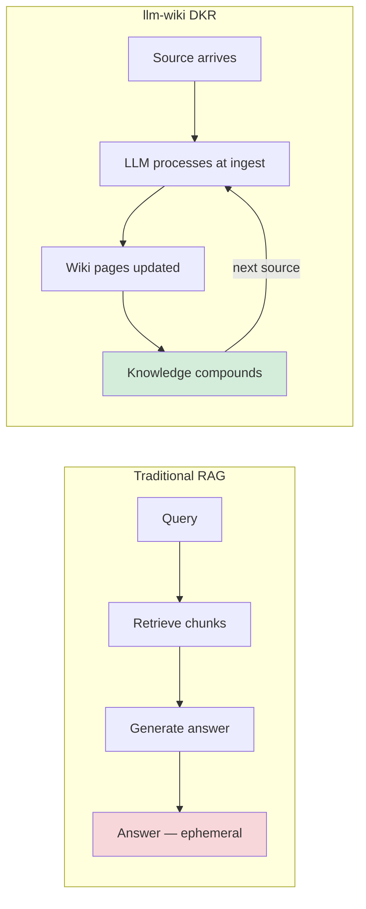
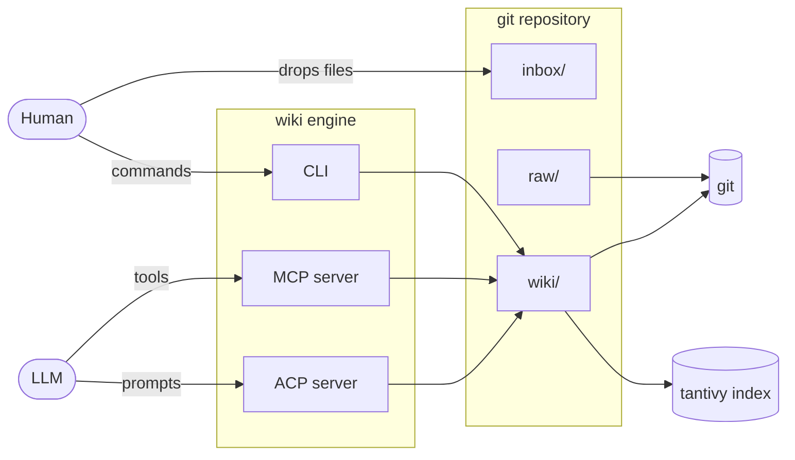
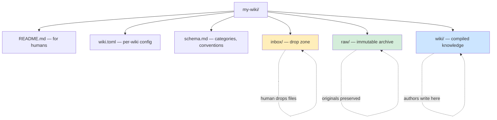
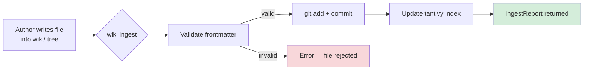
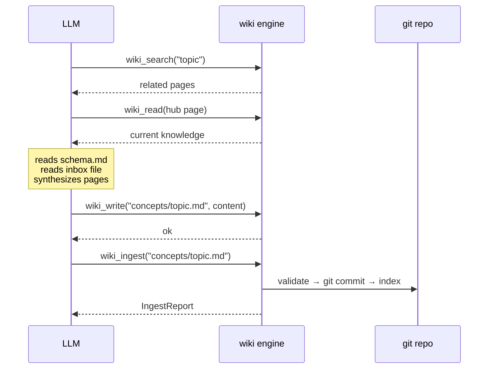
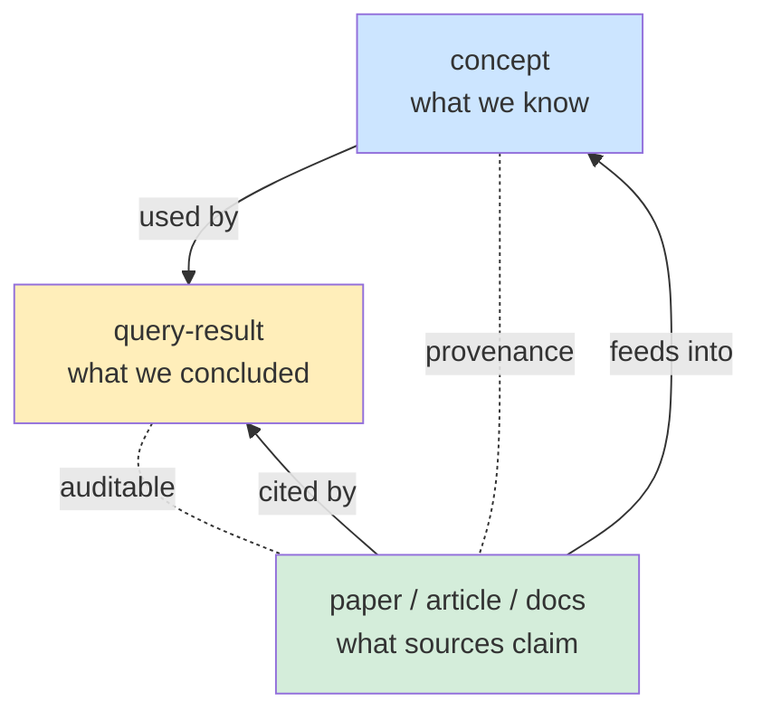
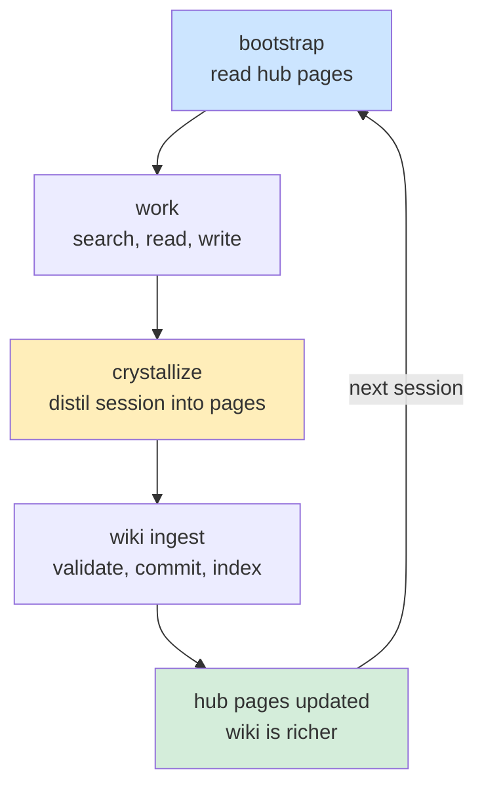

# llm-wiki

**Build knowledge that compounds — not answers that evaporate.**

A git-backed wiki engine that turns a folder of Markdown files into a
searchable, structured knowledge base. Accessible from the command line,
from any MCP-compatible agent, or from any IDE via ACP.

The engine has no LLM dependency. It manages files, git history, full-text
search, and knowledge structure. The LLM is always external.

---

## The Problem

Most AI knowledge tools use RAG: upload documents, ask a question, the system
retrieves relevant text and generates an answer. Each query starts from scratch.
Knowledge does not accumulate.

llm-wiki implements a **Dynamic Knowledge Repository** (DKR): process sources
at ingest time, not query time. The LLM reads each source, integrates it into
the existing wiki — updating concept pages, creating source summaries, flagging
contradictions — and commits the result. Knowledge compounds with every
addition. The wiki grows smarter over time without re-deriving anything.



| | Traditional RAG | llm-wiki (DKR) |
|--|-----------------|----------------|
| When knowledge is built | At query time, per question | At ingest time, once per source |
| Cross-references | Discovered ad hoc or missed | Pre-built, continuously maintained |
| Contradiction detection | Never | Flagged at ingest time |
| Knowledge accumulation | None — resets each query | Compounds over time |
| Activity log | None | Git history (semantic commits) |
| Data ownership | Provider systems | Your files, your git repo |

→ [Full rationale](docs/specifications/overview.md)

---

## Quick Start

```bash
# Install
cargo install llm-wiki

# Initialize a wiki
llm-wiki init ~/wikis/research --name research

# Start the MCP server
llm-wiki serve
```

Connect an MCP client (see [setup](#mcp-client-setup)), then use the
tools to create pages, ingest sources, search, and build knowledge.

---

## How It Works

### Architecture

The engine sits between humans, LLMs, and the wiki repository:



### The Four Layers

A wiki repository is a Dynamic Knowledge Repository. The engine enforces the
flow from inbox to archive to knowledge:



→ [Repository layout](docs/specifications/core/repository-layout.md)

### The Ingest Loop

Authors (human or LLM) write directly into the wiki tree. The engine
validates, commits to git, and indexes. The two are independent — the engine
works without an LLM, the LLM works through the engine's MCP interface.



The full LLM-driven ingest workflow via MCP:



→ [Ingest pipeline](docs/specifications/pipelines/ingest.md)

### The Epistemic Model

The `type` field carries the distinction between what we know, what sources
claim, and what we concluded:



A concept page is everything we know about MoE, from all sources. A source
page is what one paper said about MoE. A query-result is a conclusion drawn
at a specific point in time. Keeping them separate preserves provenance and
makes knowledge auditable.

→ [Epistemic model](docs/specifications/core/epistemic-model.md)

### The Bootstrap Loop

Every LLM session starts cold. The wiki is the persistent context.
Crystallize and bootstrap form a compounding loop:



Each session starts from a richer baseline than the last. The wiki is the
accumulator. The LLM is stateless — the wiki is not.

→ [Session bootstrap](docs/specifications/llm/session-bootstrap.md) ·
[Crystallize](docs/specifications/pipelines/crystallize.md) ·
[All diagrams](docs/diagrams.md)

---

## What It Is Not

- Not an LLM — makes no AI calls
- Not a RAG system — does not retrieve and generate on demand
- Not a note-taking app — it is an engine, you bring your own interface
- Not a static site generator — it is a knowledge base, not a website

---

## Core Concepts

- **Wiki** — a git repository with `inbox/`, `raw/`, and `wiki/` directories.
  One wiki = one git repo.
- **Page** — a Markdown file with YAML frontmatter. Either a flat `.md` file
  or a bundle folder with `index.md` and co-located assets.
- **Slug** — the stable address of a page, derived from its path relative to
  `wiki/` without extension. `concepts/mixture-of-experts` resolves to either
  `concepts/mixture-of-experts.md` or `concepts/mixture-of-experts/index.md`.
- **`wiki://` URI** — portable reference format. `wiki://research/concepts/moe`
  addresses a page in the `research` wiki. `wiki://concepts/moe` uses the
  default wiki.
- **Ingest** — validate, commit, and index files already in the wiki tree.
  Authors write directly into `wiki/`, then run `llm-wiki ingest`.
- **Search** — full-text BM25 search via tantivy, returning ranked results
  with `wiki://` URIs.

→ [Page content](docs/specifications/core/page-content.md) ·
[Frontmatter](docs/specifications/core/frontmatter-authoring.md) ·
[Source classification](docs/specifications/core/source-classification.md)

---

## Technology Foundation

llm-wiki is a single Rust binary — no runtime, no garbage collector, no
external services. Everything is embedded.

| Layer | Technology | Role |
|-------|-----------|------|
| Language | [Rust](https://www.rust-lang.org/) | Memory-safe, single binary, zero-cost abstractions |
| CLI | [clap](https://crates.io/crates/clap) | Derive-based command parsing |
| Async runtime | [tokio](https://crates.io/crates/tokio) | Async I/O for MCP/ACP servers |
| Full-text search | [tantivy](https://crates.io/crates/tantivy) | Embedded BM25 search engine (Lucene-class) |
| Git | [git2](https://crates.io/crates/git2) (libgit2) | Programmatic git — commit, diff, history |
| Markdown | [comrak](https://crates.io/crates/comrak) | CommonMark + GFM parsing |
| Graph | [petgraph](https://crates.io/crates/petgraph) | Concept graph traversal and visualization |
| MCP server | [rmcp](https://crates.io/crates/rmcp) | Model Context Protocol (stdio + SSE) |
| ACP server | [agent-client-protocol](https://crates.io/crates/agent-client-protocol) | Agent Communication Protocol |
| Serialization | [serde](https://crates.io/crates/serde) | YAML frontmatter, TOML config, JSON transport |

No database. No Docker. No cloud dependency. The wiki is plain Markdown in a
git repository — any tool that reads Markdown can read the wiki.

---

## CLI Reference

See [docs/specifications/commands/cli.md](docs/specifications/commands/cli.md)
for the full command reference. Summary:

```
llm-wiki init <path> --name <name>       Initialize a new wiki
llm-wiki new page <uri> [--bundle]       Create a page with scaffolded frontmatter
llm-wiki new section <uri>               Create a section
llm-wiki ingest <path> [--dry-run]       Validate, commit, and index
llm-wiki search "<query>"                Full-text BM25 search
llm-wiki read <slug|uri>                 Fetch page content
llm-wiki list [--type] [--status]        Paginated page listing
llm-wiki lint                            Structural audit
llm-wiki lint fix                        Auto-fix missing stubs and empty sections
llm-wiki graph [--format mermaid|dot]    Concept graph
llm-wiki index rebuild                   Rebuild search index
llm-wiki index status                    Check index health
llm-wiki index check                     Index integrity check
llm-wiki config get|set|list             Read/write configuration
llm-wiki spaces list|remove|set-default  Manage wiki spaces
llm-wiki serve [--sse] [--acp]           Start MCP/ACP server
llm-wiki instruct [<workflow>]           Print workflow instructions
```

---

## MCP Client Setup

<details>
<summary>Claude Code</summary>

```bash
claude plugin add /path/to/llm-wiki
```

→ [Claude plugin](docs/specifications/integrations/claude-plugin.md)

</details>

<details>
<summary>Cursor</summary>

Add to `.cursor/mcp.json`:

```json
{
  "mcpServers": {
    "llm-wiki": {
      "command": "llm-wiki",
      "args": ["serve"]
    }
  }
}
```

</details>

<details>
<summary>VS Code</summary>

Add to `.vscode/mcp.json`:

```json
{
  "servers": {
    "llm-wiki": {
      "type": "stdio",
      "command": "llm-wiki",
      "args": ["serve"]
    }
  }
}
```

</details>

<details>
<summary>Windsurf</summary>

Add to the Windsurf MCP config:

```json
{
  "mcpServers": {
    "llm-wiki": {
      "command": "llm-wiki",
      "args": ["serve"]
    }
  }
}
```

</details>

→ [MCP client integration](docs/specifications/integrations/mcp-clients.md) ·
[ACP transport](docs/specifications/integrations/acp-transport.md)

---

## Specifications

The full design is documented in [`docs/specifications/`](docs/specifications/):

| Area | Documents |
|------|-----------|
| Overview | [overview](docs/specifications/overview.md) · [features](docs/specifications/features.md) |
| Core model | [epistemic model](docs/specifications/core/epistemic-model.md) · [frontmatter](docs/specifications/core/frontmatter-authoring.md) · [page content](docs/specifications/core/page-content.md) · [repository layout](docs/specifications/core/repository-layout.md) · [source classification](docs/specifications/core/source-classification.md) |
| Pipelines | [ingest](docs/specifications/pipelines/ingest.md) · [crystallize](docs/specifications/pipelines/crystallize.md) · [asset ingest](docs/specifications/pipelines/asset-ingest.md) |
| Commands | [cli](docs/specifications/commands/cli.md) · [init](docs/specifications/commands/init.md) · [search](docs/specifications/commands/search.md) · [read](docs/specifications/commands/read.md) · [list](docs/specifications/commands/list.md) · [lint](docs/specifications/commands/lint.md) · [graph](docs/specifications/commands/graph.md) · [serve](docs/specifications/commands/serve.md) · [spaces](docs/specifications/commands/spaces.md) · [instruct](docs/specifications/commands/instruct.md) |
| Integrations | [MCP clients](docs/specifications/integrations/mcp-clients.md) · [ACP transport](docs/specifications/integrations/acp-transport.md) · [Claude plugin](docs/specifications/integrations/claude-plugin.md) |
| LLM workflows | [session bootstrap](docs/specifications/llm/session-bootstrap.md) · [backlink quality](docs/specifications/llm/backlink-quality.md) |
| Implementation | [Rust modules](docs/specifications/rust-modules.md) |

---

## Acknowledgments

This project would not exist without the ideas and work of others.
A very big thanks to:

- **[Andrej Karpathy](https://karpathy.ai/)** — for the original
  [LLM Wiki gist](https://gist.github.com/karpathy/442a6bf555914893e9891c11519de94f)
  that defined the Dynamic Knowledge Repository pattern: process sources at
  ingest time, build a persistent compounding wiki, let the LLM do the
  bookkeeping. The core idea — that knowledge should be compiled once and kept
  current, not re-derived on every query — is the foundation of everything here.

- **[vanillaflava](https://github.com/vanillaflava)** — for
  [llm-wiki-claude-skills](https://github.com/vanillaflava/llm-wiki-claude-skills),
  which turned Karpathy's pattern into a practical skill architecture.
  The crystallize pattern (distilling chat sessions into durable wiki pages),
  the session bootstrap loop, the backlink quality gate, and the
  filesystem-as-state-machine design all originate from this work.

llm-wiki is also a natural continuation of
[agent-foundation](https://github.com/geronimo-iia/agent-foundation) —
an earlier exploration of agent infrastructure patterns that led directly
to the engine design here.

---

## License

[MIT](LICENSE-MIT) OR [Apache-2.0](LICENSE-APACHE)
