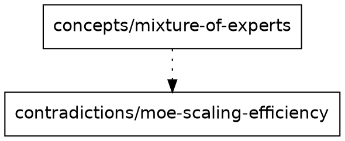
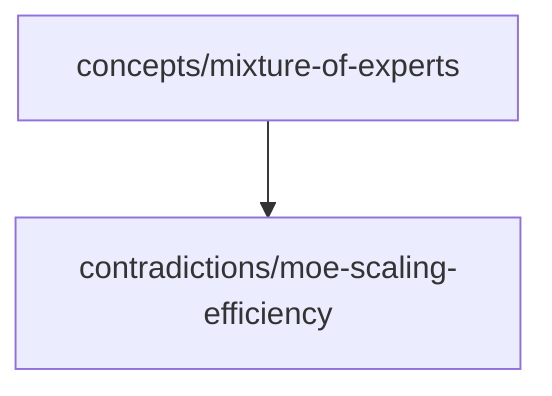

# Graph Module — `graph.rs`

Builds an in-memory directed graph from wiki page links and emits it as DOT or
Mermaid for visualisation and structural analysis.

---

## Node / edge model

**Nodes** — every `.md` file under `wiki_root` (except `.wiki/`) becomes a node
whose label is the slug: the file path relative to `wiki_root` without the `.md`
extension.

```
concepts/mixture-of-experts
sources/switch-transformer-2021
contradictions/moe-scaling-efficiency
```

**Edges** — three kinds, each carried as an `EdgeKind` variant on the `DiGraph`:

| Variant | Source field | Example |
|---|---|---|
| `WikiLink` | `[[target]]` syntax in page body | `[[concepts/moe]]` |
| `RelatedConcept` | `related_concepts:` frontmatter list | `related_concepts: ["scaling-laws"]` |
| `Contradiction` | `contradictions:` frontmatter list | `contradictions: ["contradictions/moe-eff"]` |

Both `related_concepts` and `contradictions` values are normalised: trailing `.md`
is stripped so `mixture-of-experts.md` becomes `mixture-of-experts`.

**Wikilink parsing** uses the comrak `wikilinks_title_after_pipe` extension.
The AST is walked for `NodeValue::WikiLink` nodes; the `url` field is the target.

---

## `WikiGraph` struct

```rust
pub struct WikiGraph {
    pub inner: DiGraph<String, EdgeKind>,
    pub(crate) node_map: HashMap<String, NodeIndex>,
}
```

`node_map` is `pub(crate)` so sibling modules (`contradiction::cluster`,
`lint`) can look up node indices by slug without leaking petgraph internals
to external callers.

---

## `build_graph(wiki_root) -> Result<WikiGraph>`

Two-pass walk over `WalkDir`:

1. **Registration pass** — every `.md` file (excluding `.wiki/`) becomes a node.
2. **Edge pass** — each file is read; frontmatter is deserialised into a minimal
   `GraphFrontmatter` struct (only `contradictions` and `related_concepts` fields,
   both `#[serde(default)]`) to avoid failing on either `PageFrontmatter` or
   `ContradictionFrontmatter` shapes.
   - Frontmatter edges are added for each non-empty target.
   - Body `[[wikilinks]]` are extracted via comrak and added as `WikiLink` edges.
   - Targets that don't already have a node (i.e. referenced but not on disk) are
     added as nodes — this is how `missing_stubs` knows about them.

---

## Orphan detection — `orphans(graph) -> Vec<String>`

A node is an orphan when its **in-degree is 0**: no other page links to it.

**Exclusion rules:**
- Slugs that are exactly `raw` or start with `raw/` are excluded. Raw source files
  are not expected to have inbound links; flagging them as orphans would be noise.
- `.wiki/` files are never added to the graph, so they never appear.

```rust
graph.inner.edges_directed(idx, Direction::Incoming).next().is_none()
```

---

## Missing stubs — `missing_stubs(graph, wiki_root) -> Vec<String>`

A stub is a node that has **at least one inbound edge** (something references it)
but whose `.md` file **does not exist on disk**. These nodes are created during
the edge pass whenever a link target has no corresponding file.

```rust
// node has inbound edges AND no .md file on disk
edges_directed(idx, Direction::Incoming).next().is_some()
    && !wiki_root.join(format!("{slug}.md")).exists()
```

---

## DOT output — `dot_output(graph) -> String`

Emits a `digraph wiki { ... }` block:



Edge styles by kind:
- `WikiLink` — `solid`
- `RelatedConcept` — `dashed`
- `Contradiction` — `dotted`

Node labels use `n{index}` IDs to avoid DOT identifier conflicts. Double-quotes
in slugs are escaped as `\"`. Empty slugs are skipped.

---

## Mermaid output — `mermaid_output(graph) -> String`

Emits a `graph TD` block compatible with Mermaid v10+:



All nodes are emitted (including isolated ones). Double-quotes in labels become
`&quot;`; `[` and `]` become `(` and `)` to avoid Mermaid syntax conflicts.

---

## Usage in the CLI

```bash
wiki graph              # DOT to stdout (pipe to dot -Tsvg)
wiki graph --format mermaid
```

`wiki graph` is a read-only operation — it never writes to disk or commits.
