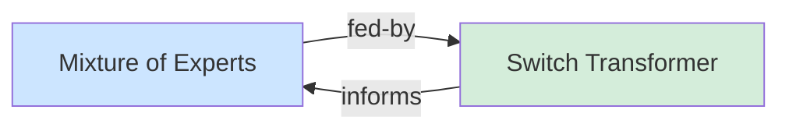

# Getting Started

A complete walkthrough from installation to a working wiki with
searchable pages and a concept graph.

## 1. Install

```bash
# macOS / Linux
curl -fsSL https://raw.githubusercontent.com/geronimo-iia/llm-wiki/main/install.sh | bash

# Or via cargo
cargo install llm-wiki
```

Verify:

```bash
llm-wiki --version
```

See [installation.md](installation.md) for all options.

## 2. Create a Wiki

```bash
llm-wiki spaces create ~/wikis/research --name research
```

This creates:

```
~/wikis/research/
├── README.md
├── wiki.toml
├── schemas/
│   ├── base.json
│   ├── concept.json
│   ├── paper.json
│   └── ...
├── inbox/
├── raw/
└── wiki/
```

The first wiki becomes the default. Check:

```bash
llm-wiki spaces list
```

## 3. Create a Page

```bash
llm-wiki content new concepts/mixture-of-experts --name "Mixture of Experts"
```

This scaffolds `wiki/concepts/mixture-of-experts.md` with frontmatter
and a body template based on the type. Add `--type concept` for a
concept-specific body structure:

```bash
llm-wiki content new concepts/mixture-of-experts --name "Mixture of Experts" --type concept
```

Frontmatter:

```yaml
---
title: "Mixture of Experts"
type: page
status: draft
last_updated: "2025-07-20"
---
```

Edit the file — change the type, add content:

```markdown
---
title: "Mixture of Experts"
type: concept
status: active
summary: "Sparse routing of tokens to expert subnetworks."
read_when:
  - "Understanding MoE architecture"
tags: [moe, scaling, sparse]
last_updated: "2025-07-20"
---

## Overview

MoE routes tokens to sparse expert subnetworks, trading compute
efficiency for model capacity.

## Key Ideas

- Each token is routed to a subset of experts
- Gating network decides which experts to activate
- Scales model parameters without scaling compute linearly
```

## 4. Ingest

```bash
llm-wiki ingest concepts/mixture-of-experts.md
```

This validates frontmatter against the `concept` schema, indexes the
page in tantivy, and commits to git.

## 5. Add a Source

Create a paper page that the concept references:

```bash
llm-wiki content new sources/switch-transformer --name "Switch Transformer"
```

Edit `wiki/sources/switch-transformer.md`:

```markdown
---
title: "Switch Transformer"
type: paper
status: active
summary: "Switch Transformer scales to trillion parameters using sparse MoE."
concepts:
  - concepts/mixture-of-experts
tags: [moe, scaling]
last_updated: "2025-07-20"
---

## Key Claims

- Simplified MoE routing with a single expert per token
- Scales to 1.6T parameters with improved training stability
```

Now update the concept page to reference this source — add to its
frontmatter:

```yaml
sources:
  - sources/switch-transformer
```

Ingest both:

```bash
llm-wiki ingest wiki/
```

## 6. Search

```bash
llm-wiki search "mixture of experts"
```

Output:

```
slug:  concepts/mixture-of-experts
uri:   wiki://research/concepts/mixture-of-experts
title: Mixture of Experts
score: 0.94

slug:  sources/switch-transformer
uri:   wiki://research/sources/switch-transformer
title: Switch Transformer
score: 0.81
```

Filter by type:

```bash
llm-wiki search "MoE" --type concept
llm-wiki search "MoE" --type paper
```

## 7. List Pages

```bash
llm-wiki list
```

```
concepts/mixture-of-experts      concept          active   Mixture of Experts
sources/switch-transformer       paper            active   Switch Transformer

Page 1/1 (2 total)
```

Filter:

```bash
llm-wiki list --type concept
llm-wiki list --status draft
```

## 8. View the Graph

```bash
llm-wiki graph
```



Filter by relation:

```bash
llm-wiki graph --relation fed-by
llm-wiki graph --root concepts/mixture-of-experts --depth 2
```

## 9. Connect an IDE

Start the MCP server:

```bash
llm-wiki serve
```

Add `--watch` for live indexing — external edits are picked up
automatically:

```bash
llm-wiki serve --watch
```

Connect your editor — see [ide-integration.md](ide-integration.md).
Now the agent can search, read, write, and ingest through the wiki
tools.

## Next Steps

- [Custom types](custom-types.md) — add your own page types
- [IDE integration](ide-integration.md) — connect to VS Code, Cursor, Zed
- [CI/CD](ci-cd.md) — validate and index in pipelines
- [Multi-wiki](multi-wiki.md) — manage multiple wikis
