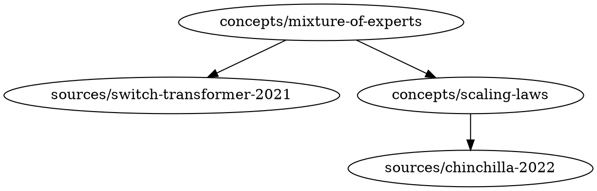

# Graph

`llm-wiki graph` builds a directed graph from wiki page links and outputs it in
Mermaid or DOT format. The graph is built from frontmatter fields (`sources`,
`concepts`) and body `[[links]]` via petgraph.

---

## 1. Graph Construction

Edges are derived from:

| Frontmatter field | Edge direction |
|-------------------|----------------|
| `sources` | page → source |
| `concepts` | page → concept |
| Body `[[links]]` | page → linked page |

Only pages that exist in the wiki are included. Broken references (missing
stubs) are silently skipped — use `llm-wiki lint` to surface them.

---

## 2. Output Formats

### Mermaid (default)

```
graph TD
  concepts/mixture-of-experts --> sources/switch-transformer-2021
  concepts/mixture-of-experts --> concepts/scaling-laws
  concepts/scaling-laws --> sources/chinchilla-2022
```

### DOT



---

## 3. Output File Frontmatter

When `--output` writes a `.md` file, minimal frontmatter is prepended:

```markdown
---
title: "Wiki Graph"
generated: "2025-07-15T14:32:01Z"
format: mermaid
root: concepts/mixture-of-experts
depth: 3
types: [concept, source]
status: generated
---

```graph
graph TD
  ...
```
```

`status: generated` marks the file as auto-generated — excluded from orphan
detection and lint checks. Use `llm-wiki commit` to commit the output file.

---

## 4. CLI Interface

```
llm-wiki graph
          [--format <fmt>]       # mermaid | dot (default: from config)
          [--root <slug|uri>]    # subgraph from this node (default: full graph)
          [--depth <n>]          # hop limit from root or global (default: from config)
          [--type <types>]       # comma-separated page types to include
          [--output <path>]      # file path or stdout if omitted (default: from config)
          [--dry-run]            # print what would be written
          [--wiki <name>]
```

### Examples

```bash
llm-wiki graph                                          # full graph, mermaid, stdout
llm-wiki graph --format dot                             # full graph, DOT
llm-wiki graph --root concepts/mixture-of-experts       # subgraph from MoE, depth 3
llm-wiki graph --root concepts/mixture-of-experts --depth 2
llm-wiki graph --type concept,source                    # concepts and sources only
llm-wiki graph --output graph.md                        # write to file
llm-wiki graph --output wiki://research/graph           # write to wiki page directly
```

---

## 5. Root + Depth Behavior

| `--root` | `--depth` | Behavior |
|----------|-----------|----------|
| not set | not set | full graph, all nodes |
| not set | N | full graph, edges only between nodes within N hops of any node |
| set | not set | subgraph from root, default depth from config (built-in: 3) |
| set | N | subgraph from root, N hops |

---

## 6. MCP Tool

```rust
#[tool(description = "Generate a concept graph from wiki page links")]
async fn wiki_graph(
    &self,
    #[tool(param)] format: Option<String>,      // mermaid | dot
    #[tool(param)] root: Option<String>,        // slug or wiki:// URI
    #[tool(param)] depth: Option<usize>,
    #[tool(param)] r#type: Option<String>,      // comma-separated types
    #[tool(param)] output: Option<String>,      // file path or wiki:// URI
    #[tool(param)] wiki: Option<String>,
) -> GraphReport { ... }

pub struct GraphReport {
    pub nodes:   usize,
    pub edges:   usize,
    pub output:  String,    // "stdout" or file path
}
```
