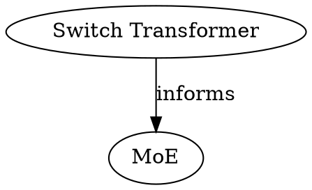

# Graph

The concept graph is built from the tantivy index and page links using
petgraph. Nodes are typed (by page `type`), edges are labeled (by
`x-graph-edges` relation declarations).

For edge declarations per type, see
[type-system.md](../model/type-system.md).


## Graph Construction

### Edge sources

Edges come from frontmatter fields declared in `x-graph-edges` and from
body wiki-links:

| Field | Relation | Used by |
|-------|----------|--------|
| `sources` | `fed-by` | concept, query-result |
| `sources` | `cites` | source types |
| `sources` | `informed-by` | doc |
| `concepts` | `depends-on` | concept, query-result |
| `concepts` | `informs` | source types |
| `document_refs` | `documented-by` | skill |
| `superseded_by` | `superseded-by` | all types |
| `[[wiki-links]]` | `links-to` | body text (generic) |

The same field name (`sources`) can have different relations depending
on the page type. The engine reads `x-graph-edges` from the type's JSON
Schema to determine the relation label.

For the `x-graph-edges` format, see
[type-system.md](../model/type-system.md). For per-type edge
declarations, see the individual type docs under
[types/](../model/types/).

Only pages that exist in the local index are included as full nodes.
Cross-wiki references (`wiki://` URIs) produce external placeholder nodes — see
[Cross-wiki edges](#cross-wiki-edges) below.

### Build process

1. Read tantivy index — collect all pages with their `type` and link
   fields
2. Read `x-graph-edges` from type schemas — map field names to relation
   labels and target type constraints
3. Parse `[[wiki-links]]` from page bodies
4. Build petgraph: typed nodes, labeled directed edges
5. Optionally warn when edge target has wrong type (per `target_types`)


## Cross-wiki edges

Links to pages in other wikis use `wiki://name/slug` URI syntax. These are stored
as-is in the tantivy index and handled at graph build time.

### `ParsedLink` enum

Link values from frontmatter edge fields and body `[[wikilinks]]` are classified
during graph construction:

```
ParsedLink::Local(slug)                      — bare slug, resolves within this wiki
ParsedLink::CrossWiki { wiki, slug }         — wiki:// URI, resolves in another wiki
```

### Single-wiki graph

When building a single-wiki graph, `CrossWiki` targets that have no matching local
node are added as **external placeholder nodes**:

- `PageNode.external = true`
- `slug` = the slug portion of the URI
- `title` = the full `wiki://name/slug` string
- `type` = `"external"`

External nodes are rendered with distinct styling (dashed border). They carry no
metadata from the local index.

### Unified graph (`cross_wiki: true`)

`build_graph_cross_wiki` accepts a slice of `(wiki_name, Searcher, IndexSchema,
TypeRegistry)` tuples. It:

1. Builds a per-wiki node set with slugs prefixed by wiki name
2. Constructs a unified `wiki_name/slug → NodeIndex` map
3. Re-resolves cross-wiki edges from the merged map — previously external nodes
   become fully resolved nodes when both wikis are mounted

### Lint rule

`wiki_lint(rules: "broken-cross-wiki-link")` reports a `Warning` when a `wiki://`
URI references a wiki name not currently in the space registry. Unmounted does not
mean wrong — the warning is advisory.

## Filtering

`wiki_graph` supports filtering at render time:

| Filter | Effect |
|--------|--------|
| `--type concept` | Include only concept nodes (and their edges) |
| `--type concept,paper` | Include concept and paper nodes |
| `--relation fed-by` | Include only `fed-by` edges |
| `--root <slug>` | Subgraph from root node |
| `--depth N` | Hop limit from root |

Filters compose: `--type concept --relation depends-on --root concepts/moe --depth 2`.


## Output Formats

### Mermaid

```
graph LR
  concepts/moe["MoE"]:::concept
  sources/switch["Switch Transformer"]:::paper

  sources/switch -->|informs| concepts/moe

  classDef concept fill:#cce5ff
  classDef paper fill:#d4edda
```

Relation labels appear on edges. Node types map to CSS classes.

### DOT



### Output file frontmatter

When `--output` writes a `.md` file, minimal frontmatter is prepended
with `status: generated`.


## Performance

The graph is built from the tantivy index — no file reads. Construction
is O(pages + edges). Rendering is O(filtered nodes + filtered edges).

In serve mode (`llm-wiki serve`), the full unfiltered graph is cached
in memory per wiki space and reused across `wiki_graph`, `wiki_stats`,
and `wiki_suggest` calls. The cache is keyed on an index generation
counter incremented after every write (`reload_reader`). Filtered
graph requests (type, relation, root) bypass the cache and build on
demand. See [graph-cache.md](../implementation/graph-cache.md) for the
implementation.

## Community detection

Louvain clustering runs on a symmetrized view of the directed graph (each directed
edge `A→B` treated as undirected `A—B`). Results are returned as `CommunityStats`
in `wiki_stats`:

| Field | Description |
|---|---|
| `count` | Number of distinct clusters found |
| `largest` | Size of the biggest cluster |
| `smallest` | Size of the smallest cluster |
| `isolated` | Slugs in communities of size ≤ 2 — weakly connected pages |

`compute_communities` returns `None` when `node_count < min_nodes_for_communities`
(default 30). Processing order is sorted by slug for deterministic output.

`node_community_map` returns a `HashMap<slug, community_id>` for use by
`wiki_suggest` strategy 4 (community peers).

### Algorithm: louvain_phase1

Phase 1 iterates over all nodes in deterministic order (sorted by `NodeIndex`).
For each node it computes the modularity gain of moving to each neighboring
community and applies the best move immediately (greedy, in-place).

The pass repeats until no node moves in a full sweep. To prevent oscillation —
where mid-pass moves alter `sigma_tot` for later nodes, causing them to swap
back on the next pass — the loop is capped at `max_passes = n × 10` iterations,
where `n` is the number of local nodes. Well-behaved graphs converge in far
fewer passes; the cap only applies to adversarial small graphs.

## Structural topology

Three fields added to `WikiStats` (v0.4.0):

| Field | Algorithm | Complexity | Skipped when |
|-------|-----------|------------|--------------|
| `diameter` | BFS APSP (`metrics::diameter`) | O(n·(n+e)) | `local_count > max_nodes_for_diameter` |
| `radius` | BFS APSP (`metrics::radius`) | O(n·(n+e)) | same |
| `center` | BFS APSP (`metrics::center`) | O(n·(n+e)) | same |

All three operate on the directed `WikiGraph`. When skipped, fields are `null`/empty
and `structural_note` explains why.

Three `wiki_lint` rules (v0.4.0):

| Rule | Algorithm | Complexity |
|------|-----------|------------|
| `articulation-point` | Tarjan DFS (`connect::articulation_points`) | O(n+e) |
| `bridge` | Tarjan DFS (`connect::find_bridges`) | O(n+e) |
| `periphery` | BFS APSP (`metrics::periphery`) | O(n·(n+e)) — skipped above `max_nodes_for_diameter` |

`articulation-point` and `bridge` operate on a symmetrized undirected view of the
graph (external placeholder nodes excluded). Same exclusion rule as Louvain.
`periphery` uses the directed graph.

## Future Improvements

- Graph queries beyond rendering: shortest path, connected components,
  orphan detection
