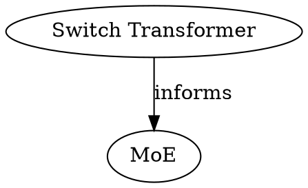

# Graph

The concept graph is built from the tantivy index and page links using
petgraph. Nodes are typed (by page `type`), edges are labeled (by
`x-graph-edges` relation declarations).

For edge declarations per type, see
[type-system.md](../model/type-system.md).


## Graph Construction

### Edge sources

Edges come from frontmatter fields declared in `x-graph-edges` and from
body wiki-links:

| Field | Relation | Used by |
|-------|----------|--------|
| `sources` | `fed-by` | concept, query-result |
| `sources` | `cites` | source types |
| `sources` | `informed-by` | doc |
| `concepts` | `depends-on` | concept, query-result |
| `concepts` | `informs` | source types |
| `document_refs` | `documented-by` | skill |
| `superseded_by` | `superseded-by` | all types |
| `[[wiki-links]]` | `links-to` | body text (generic) |

The same field name (`sources`) can have different relations depending
on the page type. The engine reads `x-graph-edges` from the type's JSON
Schema to determine the relation label.

For the `x-graph-edges` format, see
[type-system.md](../model/type-system.md). For per-type edge
declarations, see the individual type docs under
[types/](../model/types/).

Only pages that exist in the index are included. Broken references are
silently skipped.

### Build process

1. Read tantivy index — collect all pages with their `type` and link
   fields
2. Read `x-graph-edges` from type schemas — map field names to relation
   labels and target type constraints
3. Parse `[[wiki-links]]` from page bodies
4. Build petgraph: typed nodes, labeled directed edges
5. Optionally warn when edge target has wrong type (per `target_types`)


## Filtering

`wiki_graph` supports filtering at render time:

| Filter | Effect |
|--------|--------|
| `--type concept` | Include only concept nodes (and their edges) |
| `--type concept,paper` | Include concept and paper nodes |
| `--relation fed-by` | Include only `fed-by` edges |
| `--root <slug>` | Subgraph from root node |
| `--depth N` | Hop limit from root |

Filters compose: `--type concept --relation depends-on --root concepts/moe --depth 2`.


## Output Formats

### Mermaid

```
graph LR
  concepts/moe["MoE"]:::concept
  sources/switch["Switch Transformer"]:::paper

  sources/switch -->|informs| concepts/moe

  classDef concept fill:#cce5ff
  classDef paper fill:#d4edda
```

Relation labels appear on edges. Node types map to CSS classes.

### DOT



### Output file frontmatter

When `--output` writes a `.md` file, minimal frontmatter is prepended
with `status: generated`.


## Performance

The graph is built from the tantivy index — no file reads. Construction
is O(pages + edges). Rendering is O(filtered nodes + filtered edges).

## Future Improvements

- Persistent graph index alongside tantivy to avoid rebuilding petgraph
  on every call
- Graph queries beyond rendering: shortest path, connected components,
  orphan detection
- Type constraint validation at ingest time (warn when edge target has
  wrong type)
