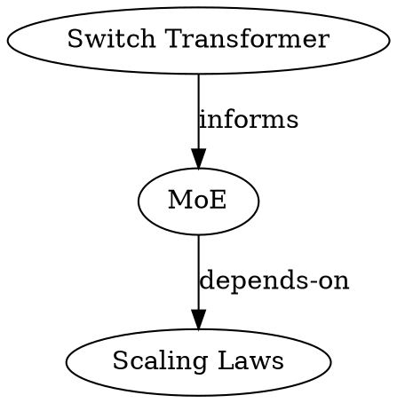

# Graph

MCP tool: `wiki_graph`

```
llm-wiki graph
          [--format <fmt>]          # mermaid | dot (default: from config)
          [--root <slug|uri>]       # subgraph from this node
          [--depth <n>]             # hop limit
          [--type <types>]          # comma-separated page types
          [--relation <label>]      # filter edges by relation
          [--output <path>]         # file path (default: stdout)
          [--wiki <name>]
```

| `--root` | `--depth` | Behavior |
|----------|-----------|----------|
| not set | not set | Full graph, all nodes |
| not set | N | Full graph, edges within N hops of any node |
| set | not set | Subgraph from root, default depth from config |
| set | N | Subgraph from root, N hops |

See [graph.md](../engine/graph.md) for the graph engine contract.

> **Note:** This specification is subject to change as the typed graph evolves.

### Output

Mermaid (default):

```
graph LR
  concepts/moe["MoE"]:::concept
  sources/switch["Switch Transformer"]:::paper
  concepts/scaling["Scaling Laws"]:::concept

  sources/switch -->|informs| concepts/moe
  concepts/moe -->|depends-on| concepts/scaling

  classDef concept fill:#cce5ff
  classDef paper fill:#d4edda
```

DOT (`--format dot`):



A summary line is printed to stderr:

```
graph: 3 nodes, 2 edges
```
