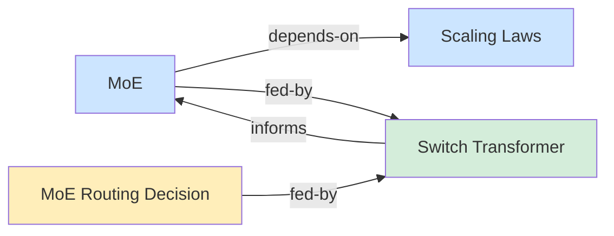

# Type-Specific Frontmatter

The wiki engine supports different frontmatter schemas depending on the
page `type`. A `type: concept` page uses the standard wiki frontmatter.
A `type: skill` page uses Claude Code / agent-foundation skill
frontmatter. The engine validates per-type using JSON Schema and indexes
uniformly.

---

## 1. The Problem

One frontmatter schema doesn't fit all page types. A concept page
carries `sources`, `concepts`, `confidence`, `claims`. A skill page
carries `name`, `description`, `allowed-tools`, `context`, `agent`. A
doc page emphasizes `read_when`, `requires_skills`. Forcing all pages
into the same schema means either:

- Ignoring type-specific fields (they exist on disk but the engine
  doesn't validate or index them)
- Requiring every field on every page (noise, confusion)

The wiki should validate what each type requires and index what each
type provides — without hardcoding every possible type in the engine.

---

## 2. Design: JSON Schema Type Profiles

### Three layers

1. **`wiki.toml` registers types** — each type has a description and a
   path to its JSON Schema file
2. **The engine validates per-type** — on `wiki_ingest`, validate the
   page's frontmatter against its type's JSON Schema
3. **The engine indexes uniformly** — field aliases map type-specific
   names to canonical index roles at ingest time

### Why JSON Schema

- **Standard** — JSON Schema Draft 2020-12, same as agent-foundation
- **Toolable** — validators exist for every language (Rust: `jsonschema`,
  `valico`; Python: `jsonschema`; JS: `ajv`)
- **Composable** — `$ref` and `allOf` for shared field definitions
- **Self-documenting** — `description` on every property
- **Extensible** — custom `x-` keywords for index aliases without
  breaking standard validators

### Why wiki.toml (not schema.md)

The type registry is structured data — type names, schema paths,
descriptions. It belongs in the engine's config file, not in a Markdown
file the engine has to parse.

`wiki.toml` is already the single source of truth for wiki identity and
engine configuration. Adding the type registry keeps everything in one
place:

- The engine reads `wiki.toml` at startup — no extra file to load
- `wiki_config get/set/list` operates on `wiki.toml` — types are
  manageable via the same tool
- The LLM reads types via `wiki_config list` — gets names +
  descriptions, enough to know what types exist and what they mean
- No Markdown-as-config parsing — `schema.md` is eliminated

---

## 3. Repository Layout

```
my-wiki/
├── wiki.toml                    ← wiki config + type registry
├── schemas/
│   ├── base.json                ← shared field definitions
│   ├── concept.json             ← type: concept
│   ├── paper.json               ← type: paper / article / documentation
│   ├── skill.json               ← type: skill
│   ├── doc.json                 ← type: doc
│   └── section.json             ← type: section
├── inbox/
├── raw/
└── wiki/
```

No `schema.md`. The type registry lives in `wiki.toml`. The JSON Schema
files live in `schemas/`. The wiki conventions that were in `schema.md`
move to skills (LLM instructions) or `README.md` (human context).

---

## 4. wiki.toml Type Registry

```toml
[wiki]
name = "research"
description = "ML research knowledge base"

[types.default]
schema = "schemas/base.json"
description = "Default page type"

[types.concept]
schema = "schemas/concept.json"
description = "Synthesized knowledge — one concept per page"

[types.paper]
schema = "schemas/paper.json"
description = "Academic source — research papers, preprints"

[types.article]
schema = "schemas/paper.json"
description = "Editorial source — blog posts, news, essays"

[types.documentation]
schema = "schemas/paper.json"
description = "Reference source — product docs, API references"

[types.skill]
schema = "schemas/skill.json"
description = "Agent skill with workflow instructions"

[types.doc]
schema = "schemas/doc.json"
description = "Reference document with agent-foundation frontmatter"

[types.section]
schema = "schemas/section.json"
description = "Section index grouping related pages"

[types.query-result]
schema = "schemas/concept.json"
description = "Saved conclusion — crystallized session, comparison"

[ingest]
auto_commit = true

[search]
top_k = 10
```

Each `[types.<name>]` entry has:

| Field | Required | Purpose |
|-------|----------|---------|
| `schema` | Yes | Path to JSON Schema file, relative to wiki root |
| `description` | Yes | What this type is — readable by LLM and human |

`[types.default]` is the fallback for pages with an unrecognized or
missing `type` field.

Multiple types can share the same schema file (e.g., `paper`, `article`,
`documentation` all use `schemas/paper.json`).

---

## 5. Schema Definitions

### Base schema — shared fields

`schemas/base.json` defines the fields common to all page types:

```json
{
  "$schema": "https://json-schema.org/draft/2020-12/schema",
  "$id": "base.json",
  "title": "Wiki Page Base",
  "description": "Shared frontmatter fields for all wiki page types.",
  "type": "object",
  "required": ["title", "summary", "read_when", "status", "type"],
  "properties": {
    "title": {
      "type": "string",
      "description": "Display name for the page.",
      "minLength": 1,
      "maxLength": 256
    },
    "summary": {
      "type": "string",
      "description": "One-line scope description.",
      "minLength": 1,
      "maxLength": 512
    },
    "read_when": {
      "type": "array",
      "description": "Conditions under which this page is relevant.",
      "items": { "type": "string" },
      "minItems": 1,
      "maxItems": 10
    },
    "status": {
      "type": "string",
      "enum": ["active", "draft", "stub", "generated"]
    },
    "type": {
      "type": "string",
      "description": "Page type from the wiki's type registry."
    },
    "last_updated": {
      "type": "string",
      "format": "date",
      "description": "ISO 8601 date of last meaningful update."
    },
    "tldr": {
      "type": "string",
      "description": "One-sentence key takeaway.",
      "maxLength": 512
    },
    "tags": {
      "type": "array",
      "items": { "type": "string", "pattern": "^[a-z0-9]+(-[a-z0-9]+)*$" },
      "description": "Lowercase hyphenated search terms."
    },
    "owner": {
      "type": "string",
      "description": "Person, team, or agent session responsible for this page."
    },
    "superseded_by": {
      "type": "string",
      "description": "Slug of the page that replaces this one."
    }
  },
  "additionalProperties": true
}
```

`additionalProperties: true` — unrecognized fields are preserved on
disk and indexed as text. The schema controls validation strictness,
not index coverage.

### Concept schema

`schemas/concept.json` extends base with knowledge-specific fields:

```json
{
  "$schema": "https://json-schema.org/draft/2020-12/schema",
  "$id": "concept.json",
  "title": "Concept Page",
  "description": "Synthesized knowledge — one concept per page.",
  "allOf": [
    { "$ref": "base.json" }
  ],
  "properties": {
    "sources": {
      "type": "array",
      "items": { "type": "string" },
      "description": "Slugs of source pages that contributed claims."
    },
    "concepts": {
      "type": "array",
      "items": { "type": "string" },
      "description": "Slugs of concept pages this page depends on."
    },
    "confidence": {
      "type": "string",
      "enum": ["high", "medium", "low"],
      "description": "Reliability signal."
    },
    "claims": {
      "type": "array",
      "items": {
        "type": "object",
        "required": ["text"],
        "properties": {
          "text": { "type": "string" },
          "confidence": { "type": "string", "enum": ["high", "medium", "low"] },
          "section": { "type": "string" }
        }
      },
      "description": "Structured claims extracted from sources."
    }
  }
}
```

### Skill schema

`schemas/skill.json` uses agent-foundation / Claude Code skill
frontmatter. The `x-index-aliases` extension tells the engine how to
map skill-specific fields to canonical index roles:

```json
{
  "$schema": "https://json-schema.org/draft/2020-12/schema",
  "$id": "skill.json",
  "title": "Skill Page",
  "description": "Agent skill stored as a wiki page.",
  "type": "object",
  "required": ["name", "description", "type"],
  "x-index-aliases": {
    "name": "title",
    "description": "summary",
    "when_to_use": "read_when"
  },
  "properties": {
    "name": {
      "type": "string",
      "description": "Skill identifier. Lowercase letters, numbers, hyphens.",
      "pattern": "^[a-z0-9]+(-[a-z0-9]+)*$",
      "maxLength": 64
    },
    "description": {
      "type": "string",
      "description": "What the skill does and when to use it.",
      "maxLength": 1536
    },
    "type": {
      "type": "string",
      "const": "skill"
    },
    "when_to_use": {
      "type": "string",
      "description": "Additional activation context, appended to description."
    },
    "compatibility": {
      "type": "string",
      "description": "Human-readable environment requirements.",
      "maxLength": 500
    },
    "allowed-tools": {
      "description": "Tools pre-approved when this skill is active.",
      "oneOf": [
        { "type": "string" },
        { "type": "array", "items": { "type": "string" } }
      ]
    },
    "disable-model-invocation": {
      "type": "boolean",
      "description": "Prevent automatic invocation.",
      "default": false
    },
    "user-invocable": {
      "type": "boolean",
      "description": "Show in slash-command menu.",
      "default": true
    },
    "context": {
      "type": "string",
      "enum": ["fork"],
      "description": "Set to fork to run in a subagent."
    },
    "agent": {
      "type": "string",
      "description": "Subagent type when context is fork."
    },
    "model": {
      "type": "string",
      "description": "Model override for this skill."
    },
    "effort": {
      "type": "string",
      "enum": ["low", "medium", "high", "xhigh", "max"],
      "description": "Effort level override."
    },
    "paths": {
      "description": "Glob patterns for file-based activation.",
      "oneOf": [
        { "type": "string" },
        { "type": "array", "items": { "type": "string" } }
      ]
    },
    "hooks": {
      "type": "object",
      "description": "Hooks scoped to this skill's lifecycle."
    },
    "shell": {
      "type": "string",
      "enum": ["bash", "powershell"],
      "default": "bash"
    },
    "argument-hint": {
      "type": "string",
      "description": "Hint shown during autocomplete."
    },
    "license": {
      "type": "string",
      "description": "License identifier."
    },
    "metadata": {
      "type": "object",
      "properties": {
        "author": { "type": "string" },
        "version": { "type": "string" },
        "homepage": { "type": "string", "format": "uri" }
      },
      "description": "Publishing metadata."
    },
    "status": {
      "type": "string",
      "enum": ["active", "draft", "stub", "generated"]
    },
    "last_updated": {
      "type": "string",
      "format": "date"
    },
    "tags": {
      "type": "array",
      "items": { "type": "string" }
    },
    "owner": {
      "type": "string"
    },
    "superseded_by": {
      "type": "string"
    }
  },
  "additionalProperties": true
}
```

The skill schema does **not** use `allOf: [{ "$ref": "base.json" }]`
because it replaces the base required fields (`title`/`summary` →
`name`/`description`). The `x-index-aliases` extension handles the
mapping.

### Doc schema

`schemas/doc.json` uses agent-foundation doc frontmatter:

```json
{
  "$schema": "https://json-schema.org/draft/2020-12/schema",
  "$id": "doc.json",
  "title": "Document Page",
  "description": "Reference document with agent-foundation frontmatter.",
  "allOf": [
    { "$ref": "base.json" }
  ],
  "properties": {
    "requires_skills": {
      "type": "array",
      "items": { "type": "string" },
      "description": "Skill slugs needed for this doc to be actionable."
    },
    "source_study": {
      "type": "string",
      "description": "Research study slug that informed this doc."
    },
    "documents_skill": {
      "type": "string",
      "description": "Skill slug this doc describes."
    },
    "produced_by": {
      "type": "string",
      "description": "Task slug that produced this doc."
    }
  }
}
```

---

## 6. The `x-index-aliases` Extension

Standard JSON Schema validators ignore `x-` prefixed keywords. The wiki
engine reads `x-index-aliases` to map type-specific field names to
canonical index roles.

```json
"x-index-aliases": {
  "name": "title",
  "description": "summary",
  "when_to_use": "read_when"
}
```

Semantics:

- **Key** = source field name in the frontmatter (e.g., `name`)
- **Value** = canonical index field (e.g., `title`)
- At ingest time, if the source field exists and the canonical field
  does not, the engine indexes the source value under the canonical name
- If both exist, the canonical field wins — the alias is ignored
- Aliases affect indexing only — the file on disk is never rewritten
- Schemas without `x-index-aliases` have no aliasing (all base-derived
  schemas)

### Canonical index fields

The engine defines a fixed set of canonical index fields. Aliases must
target one of these:

| Canonical field | Index type | Role |
|----------------|-----------|------|
| `title` | Text (tokenized) | Display name |
| `summary` | Text (tokenized) | Discovery text |
| `read_when` | Text (tokenized) | Retrieval conditions |
| `tldr` | Text (tokenized) | Key takeaway |
| `tags` | Keyword (per entry) | Search terms |
| `type` | Keyword | Classification |
| `status` | Keyword | Lifecycle state |
| `sources` | Keyword (per entry) | Graph edges (provenance) |
| `concepts` | Keyword (per entry) | Graph edges (dependency) |
| `superseded_by` | Keyword | Graph edge (supersession) |
| `owner` | Keyword | Ownership |
| `confidence` | Keyword | Reliability signal |
| `last_updated` | Date | Timestamp |

Fields not aliased to a canonical field are indexed as generic text
(strings get tokenized into the body text field; lists of strings become
keywords).

---

## 7. Engine Behavior

### Ingest

```
1. Parse YAML frontmatter
2. Read `type` field (default: "page" if missing)
3. Look up type in wiki.toml [types.<type>] → get schema path
4. Fall back to [types.default] if type not registered
5. Load the JSON Schema file from schemas/
6. Validate frontmatter against the schema → reject if invalid
7. Read `x-index-aliases` from the schema
8. Apply aliases: for each alias, if source exists and target doesn't,
   index source value under the canonical name
9. Index all canonical fields in tantivy
10. Index unrecognized string fields as body text
11. Store original frontmatter as-is (no rewriting)
12. Commit to git (if auto_commit)
```

### Search, List, Graph, Read

No change. These tools operate on canonical index fields. They don't
know or care which type produced the data. A skill page with
`name: my-skill` is findable by searching "my-skill" because `name` was
aliased to `title` at ingest time.

---

## 8. What This Enables

### Skill pages in the wiki

```yaml
---
name: ingest
description: >
  Process source files into synthesized wiki pages.
type: skill
status: active
last_updated: "2025-07-17"
allowed-tools: Read Write Edit Bash Grep Glob
disable-model-invocation: true
tags: [ingest, workflow]
owner: geronimo
---

# Wiki Ingest

[full skill workflow...]
```

The engine:
- Reads `type: skill` → looks up `[types.skill]` in `wiki.toml` →
  loads `schemas/skill.json`
- Validates (`name` and `description` required — present ✓)
- Aliases `name` → `title`, `description` → `summary` for indexing
- Indexes `tags`, `owner`, `type`, `status` as keywords
- The page is searchable, listable, and appears in the graph

### Custom types

Add a schema file and register in `wiki.toml`:

```toml
[types.meeting-notes]
schema = "schemas/meeting-notes.json"
description = "Meeting notes with attendees and action items"
```

```json
{
  "$schema": "https://json-schema.org/draft/2020-12/schema",
  "$id": "meeting-notes.json",
  "title": "Meeting Notes",
  "allOf": [{ "$ref": "base.json" }],
  "x-index-aliases": {
    "attendees": "owner"
  },
  "properties": {
    "attendees": {
      "type": "array",
      "items": { "type": "string" },
      "description": "People who attended."
    },
    "date": {
      "type": "string",
      "format": "date"
    },
    "action-items": {
      "type": "array",
      "items": { "type": "string" }
    }
  }
}
```

The engine doesn't need to know what "meeting-notes" means. It validates
against the schema and indexes using the alias mapping. The LLM reads
the type description via `wiki_config list`.

---

## 9. What Happened to schema.md

`schema.md` was doing two jobs:

1. **Type registry** — now in `wiki.toml` `[types.*]` with `description`
   fields
2. **Wiki conventions** — category structure, ingest rules, domain
   patterns, linking policy

The conventions move to:

| Content | New home |
|---------|----------|
| Type registry | `wiki.toml` `[types.*]` |
| Category structure | `wiki.toml` `[wiki]` description or `README.md` |
| Ingest conventions | Plugin skills (ingest, frontmatter) |
| Linking policy | Plugin skills (backlink quality) |
| Domain patterns | Plugin skills or `README.md` |

`schema.md` is eliminated. `wiki.toml` is the single source of truth
for everything the engine needs. LLM workflow instructions live in
skills.

---

## 10. Default Types

Every wiki ships with a built-in set of types. These are registered in
`wiki.toml` by `llm-wiki init` and their schemas are generated in
`schemas/`. The wiki owner can modify, remove, or add types freely.

### Knowledge types

Pages the wiki synthesizes and maintains.

| Type | Schema | Description | Epistemic role |
|------|--------|-------------|----------------|
| `concept` | `concept.json` | Synthesized knowledge — one concept per page | What we know |
| `query-result` | `concept.json` | Saved conclusion — crystallized session, comparison, decision | What we concluded |
| `section` | `section.json` | Section index grouping related pages | Navigation |

### Source types

Pages that record what a specific source claims. One page per source.

| Type | Schema | Description | Source nature |
|------|--------|-------------|---------------|
| `paper` | `paper.json` | Research papers, preprints, academic material | Academic |
| `article` | `paper.json` | Blog posts, news, long-form essays, opinion pieces | Editorial |
| `documentation` | `paper.json` | Product docs, API references, technical specifications | Reference |
| `clipping` | `paper.json` | Web saves, browser clips, bookmarks with content | Web capture |
| `transcript` | `paper.json` | Meeting transcripts, podcast transcripts, interviews | Spoken |
| `note` | `paper.json` | Freeform drafts, quick captures, personal notes | Informal |
| `data` | `paper.json` | CSV, JSON, structured datasets, spreadsheets | Structured |
| `book-chapter` | `paper.json` | Excerpts or chapters from books | Published |
| `thread` | `paper.json` | Forum threads, social media threads, discussion archives | Discussion |

### Extension types

Types for storing non-wiki artifacts alongside knowledge.

| Type | Schema | Description | Role |
|------|--------|-------------|------|
| `skill` | `skill.json` | Agent skill with workflow instructions | Capability |
| `doc` | `doc.json` | Reference document with agent-foundation frontmatter | Knowledge |

### Structural types

| Type | Schema | Description | Role |
|------|--------|-------------|------|
| `default` | `base.json` | Fallback for unrecognized or missing type | Catch-all |

### Schema sharing

All source types share `paper.json` because they have the same
frontmatter structure — the `type` field carries the distinction, not
the schema. `concept` and `query-result` share `concept.json` for the
same reason. This keeps the schema count small while supporting many
types.

### Choosing a type

- **Is this synthesized knowledge?** → `concept`
- **Is this a conclusion or decision?** → `query-result`
- **Is this a summary of a specific source?** → pick the source type
  matching the material's nature (`paper`, `article`, `documentation`,
  etc.)
- **Is this a section index?** → `section`
- **Is this an agent skill?** → `skill`
- **Is this a reference document?** → `doc`

Classify by the source material's nature, not its topic. A blog post
about academic research is `article`, not `paper`.

---

## 11. Type Relationships and Graph Modeling

The concept graph (`wiki_graph`) needs to understand not just that pages
link to each other, but *how* they relate. A `concept` fed by a `paper`
is a different relationship than a `concept` that depends on another
`concept`. For robust graph analysis, the engine needs **typed, directed
edges** with constraints on which types can participate.

### Approach: `x-graph-edges` in JSON Schema

Each type schema declares its outgoing edge types using an
`x-graph-edges` extension. This tells the engine which frontmatter
fields are graph edges, what relationship they represent, and which
target types are valid.

```json
"x-graph-edges": {
  "sources": {
    "relation": "fed-by",
    "direction": "outgoing",
    "target_types": ["paper", "article", "documentation", "clipping",
                     "transcript", "note", "data", "book-chapter", "thread"]
  },
  "concepts": {
    "relation": "depends-on",
    "direction": "outgoing",
    "target_types": ["concept"]
  },
  "superseded_by": {
    "relation": "superseded-by",
    "direction": "outgoing",
    "target_types": ["concept", "query-result", "doc", "skill"]
  }
}
```

### Why this approach

The established approaches for modeling type relationships are:

| Approach | Strengths | Weaknesses | Fit for llm-wiki |
|----------|-----------|------------|-------------------|
| RDF/OWL ontology | Formal semantics, inference, standard | Heavy, requires triple store, overkill for a wiki | No |
| JSON-LD + Schema.org | Linked data, web-standard | Requires `@context`, adds complexity for no wiki benefit | No |
| Property graph (Neo4j-style) | Labeled nodes + edges, queryable, practical | Needs a graph database or in-memory model | Partially — we use petgraph |
| JSON Schema + `x-` extensions | Already in use, composable, toolable, self-documenting | Not a formal ontology | Yes |

We already use JSON Schema for validation and `x-index-aliases` for
field mapping. Adding `x-graph-edges` keeps everything in one system.
The engine reads edge declarations from schemas at startup, petgraph
gets labeled edges, and `wiki_graph` can render and filter by
relationship type.

### Edge declaration fields

| Field | Required | Description |
|-------|----------|-------------|
| `relation` | Yes | Edge label in the graph (e.g., `fed-by`, `depends-on`, `superseded-by`) |
| `direction` | Yes | `outgoing` (this page → target) or `incoming` (target → this page) |
| `target_types` | No | Valid target types. If omitted, any type is valid. Engine warns on ingest if target page has wrong type. |

### Default edge declarations per type

**concept.json:**

```json
"x-graph-edges": {
  "sources":       { "relation": "fed-by",        "direction": "outgoing", "target_types": ["paper", "article", "documentation", "clipping", "transcript", "note", "data", "book-chapter", "thread"] },
  "concepts":      { "relation": "depends-on",    "direction": "outgoing", "target_types": ["concept"] },
  "superseded_by": { "relation": "superseded-by", "direction": "outgoing" }
}
```

**paper.json** (shared by all source types):

```json
"x-graph-edges": {
  "concepts":      { "relation": "informs",       "direction": "outgoing", "target_types": ["concept"] },
  "superseded_by": { "relation": "superseded-by", "direction": "outgoing" }
}
```

**skill.json:**

```json
"x-graph-edges": {
  "superseded_by": { "relation": "superseded-by", "direction": "outgoing" }
}
```

**doc.json:**

```json
"x-graph-edges": {
  "requires_skills":  { "relation": "requires",      "direction": "outgoing", "target_types": ["skill"] },
  "documents_skill":  { "relation": "documents",     "direction": "outgoing", "target_types": ["skill"] },
  "superseded_by":    { "relation": "superseded-by", "direction": "outgoing" }
}
```

### How the engine uses edge declarations

**At startup:** Load all type schemas, collect `x-graph-edges`
declarations into a registry of `(source_type, field, relation,
target_types)`.

**At ingest:** For each slug-list field that has an edge declaration,
index the edge with its relation label. Optionally warn if the target
page exists and its type is not in `target_types`.

**At graph build:** petgraph nodes get a `type` label. Edges get a
`relation` label. `wiki_graph` can then:

- Filter edges by relation: `wiki_graph --relation fed-by`
- Filter nodes by type: `wiki_graph --type concept`
- Render relation labels in Mermaid/DOT output
- Detect constraint violations (edge to wrong target type)
- Compute type-aware metrics (e.g., "concepts with no source edges")

### Mermaid output example



### Body links

`[[wiki-links]]` in the page body are also graph edges. Since they have
no frontmatter field, they get a generic `links-to` relation with no
type constraint. The engine parses them from the body text at ingest
time, same as today.

---

## 12. Backward Compatibility

- Pages without a `type` field default to `type: page`, validated
  against `[types.default]` schema
- Pages with a `type` that has no `[types.<type>]` entry are validated
  against `[types.default]`
- Wikis with no `schemas/` directory and no `[types.*]` entries use a
  built-in base schema — behavior is identical to current engine
- Wikis with an existing `schema.md` are unaffected — the engine
  ignores `schema.md` (it's just a Markdown file in the repo)
- No frontmatter rewriting — existing files are untouched
- `additionalProperties: true` on all schemas — unrecognized fields
  are preserved and indexed as text

---

## 13. Compatibility with Agent-Foundation

Agent-foundation uses JSON Schema Draft 2020-12 for all its formats
(skill indexes, doc indexes, agent manifests, etc.). The wiki type
schemas follow the same convention:

- Same `$schema` draft
- Same `$id` pattern
- Same `$ref` composition
- Skill and doc schemas can reference agent-foundation schemas directly
  if the wiki wants strict compatibility

A wiki that stores agent-foundation skills can use a `skill.json` schema
that `$ref`s the agent-foundation skill frontmatter definition, extended
with `x-index-aliases` for wiki indexing.

---

## 14. Summary

| Concern | How it's handled |
|---------|-----------------|
| Different types need different fields | JSON Schema per type in `schemas/` |
| Type registry | `wiki.toml` `[types.*]` with `schema` + `description` |
| Default types | 14 built-in types covering knowledge, sources, extensions, structure |
| Different field names across types | `x-index-aliases` maps to canonical index roles |
| Type relationships in graph | `x-graph-edges` declares typed directed edges with target constraints |
| Validation standard | JSON Schema Draft 2020-12 |
| Index uniformity | Aliases resolve at ingest; index sees canonical fields only |
| LLM discovers types | `wiki_config list` returns type names + descriptions |
| Existing pages keep working | `[types.default]` fallback + built-in base schema |
| Custom types | Add schema file + register in `wiki.toml` |
| Agent-foundation compatibility | Same JSON Schema draft; `$ref` composition possible |
| schema.md eliminated | Type registry → `wiki.toml`; conventions → skills |
